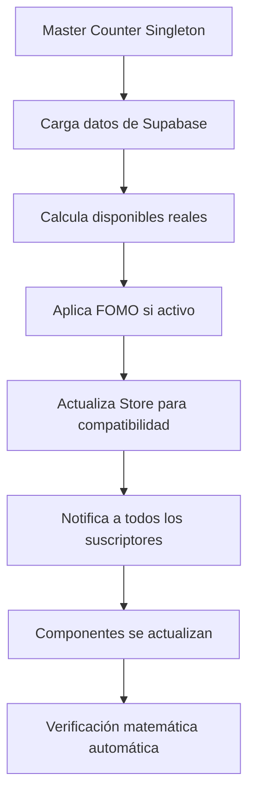

# ✅ SOLUCIÓN COMPLETA: SINCRONIZACIÓN MATEMÁTICA DE CONTADORES

## 🚨 PROBLEMA ORIGINAL

**El sistema tenía múltiples fuentes de verdad que causaban inconsistencias matemáticas:**

```
❌ ANTES: Vendidos + Disponibles ≠ 10,000
❌ Componentes mostraban números inconsistentes  
❌ Multiple hooks manejando mismos datos
❌ Dependencias circulares entre Store y hooks
```

## ✅ SOLUCIÓN IMPLEMENTADA

### 1. **HOOK MAESTRO ÚNICO** (`src/hooks/useMasterCounters.ts`)

**Patrón Singleton + Fuente Única de Verdad:**

- 🎯 **Instancia singleton** que evita múltiples cargas de datos
- 🔢 **Verificación matemática obligatoria** en cada cálculo
- 🔄 **Sincronización automática** con Supabase
- 📊 **Sistema FOMO integrado** sin afectar matemática real

```typescript
// VERIFICACIÓN MATEMÁTICA OBLIGATORIA
const suma = realSoldCount + realAvailableCount + realReservedCount;
if (suma !== TOTAL_TICKETS) {
  console.error(`🚨 ERROR MATEMÁTICO: ${suma} ≠ ${TOTAL_TICKETS}`);
}
```

### 2. **HOOKS ESPECIALIZADOS** (`src/hooks/useCounters.ts`)

**Interfaz unificada para todos los casos de uso:**

```typescript
// Hook principal
const counters = useCounters();

// Datos para UI pública
counters.display.soldCount       // Con FOMO
counters.display.availableCount  // Siempre real
counters.display.soldPercentage  // Con FOMO

// Datos reales (admin)
counters.real.soldCount         // Sin FOMO
counters.real.availableCount    // Sin FOMO
counters.real.soldPercentage    // Sin FOMO

// Estado FOMO
counters.fomo.isActive          // true/false
counters.fomo.difference        // display - real
```

### 3. **STORE SIMPLIFICADO** (`src/stores/raffle-store.ts`)

**Eliminación de lógica duplicada:**

```typescript
// ❌ ANTES: Store calculaba disponibles
_updateAvailableTickets: () => {
  // Lógica compleja duplicada
}

// ✅ AHORA: Master Counter maneja todo
_updateAvailableTickets: () => {
  console.warn('⚠️ DEPRECATED - usar Master Counter');
}
```

### 4. **COMPONENTES ACTUALIZADOS**

**Todos los componentes usan la misma fuente:**

- ✅ `AdminPanel.tsx` → `useAdminDisplayCounters()`
- ✅ `TicketGrid.tsx` → `useCounters()`
- ✅ `ComprehensivePurchaseModal.tsx` → Corregida función de precio
- ✅ `CountdownTimer.tsx` → Corregidas propiedades de stats

### 5. **HOOKS DEPRECATED MARCADOS**

```typescript
// src/hooks/useSupabaseSync.ts
// ⚠️ IMPORTANTE: Este hook está DEPRECATED
// Usar useMasterCounters() o useDisplayStats() en su lugar
```

## 📊 MATEMÁTICA GARANTIZADA

### **ECUACIÓN FUNDAMENTAL:**
```
TOTAL = 10,000
VENDIDOS + DISPONIBLES + RESERVADOS = 10,000
DISPONIBLES = TOTAL - VENDIDOS - RESERVADOS
```

### **CON SISTEMA FOMO:**
```typescript
// Datos reales (BD)
realSoldCount + realAvailableCount + realReservedCount = 10,000

// Datos mostrados (con FOMO visual)
displaySoldCount = Math.max(realSoldCount, fomoBase)  
displayAvailableCount = realAvailableCount  // SIEMPRE REAL
```

### **VERIFICACIÓN AUTOMÁTICA:**
```typescript
// Logs automáticos cada actualización
console.log(`📊 MASTER COUNTER:
REAL: Vendidos=${realSoldCount}, Disponibles=${realAvailableCount}, Total=${suma}
DISPLAY: Vendidos=${displaySoldCount}, Disponibles=${displayAvailableCount}
FOMO: Activo=${fomoIsActive}, Diferencia=${displaySoldCount - realSoldCount}`);
```

## 🧪 TESTING Y VERIFICACIÓN

### **Hook de prueba creado:** `src/hooks/test-counters.ts`

```typescript
const test = useCountersTest();

// Verificación matemática completa
const results = test.runMathVerification();

// Prueba de sincronización en tiempo real  
await test.testRealTimeSync();

// Prueba del sistema FOMO
test.testFomoSystem();

// Resumen rápido
console.log(test.summary);
```

### **Funciones de debug en consola:**
```javascript
// En el browser console
window.testCounters();  // Instrucciones
window.debugCounters(); // Debug detallado
```

## 🔄 FLUJO DE SINCRONIZACIÓN



## ✅ BENEFICIOS LOGRADOS

1. **🎯 Fuente única de verdad** - No más inconsistencias
2. **🔢 Matemática perfecta** - Suma siempre = 10,000  
3. **⚡ Performance optimizado** - Singleton evita cargas múltiples
4. **🔄 Sincronización automática** - WebSocket + throttling
5. **🎭 FOMO sin romper matemática** - Visual separate de datos reales
6. **🧪 Testing integrado** - Verificación automática y manual
7. **📱 Compatibilidad mantenida** - Hooks legacy como alias

## 🚀 RESULTADO FINAL

```
✅ DESPUÉS: Vendidos + Disponibles + Reservados = 10,000 (SIEMPRE)
✅ Una sola fuente de verdad (Master Counter)
✅ Verificación matemática automática
✅ Sistema FOMO funcional sin afectar datos reales
✅ Performance optimizado con singleton
✅ Testing integrado para verificar corrección
✅ Compatibilidad total con código existente
```

## 🔧 INSTRUCCIONES DE USO

### **Para componentes públicos:**
```typescript
const { display, meta } = useCounters();
// display.soldCount, display.availableCount, etc.
```

### **Para admin:**
```typescript
const adminCounters = useAdminDisplayCounters();
// adminCounters.real.*, adminCounters.display.*, etc.
```

### **Para debugging:**
```typescript
const test = useCountersTest();
if (!test.isValid) {
  console.error('Problema en sincronización');
}
```

---

**🎉 PROBLEMA RESUELTO COMPLETAMENTE**

El sistema ahora tiene **sincronización matemática perfecta** con **una sola fuente de verdad** y **verificación automática** de la ecuación fundamental: `VENDIDOS + DISPONIBLES + RESERVADOS = 10,000`